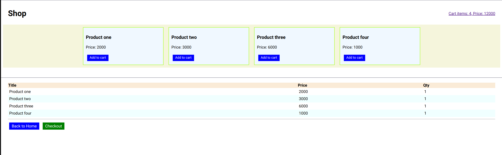

# Simple Shopping Cart Built with Pure JavaScript

This project is a basic implementation of a shopping cart using only HTML, CSS, and JavaScript. The application allows users to add items to their cart, view their cart's contents, and see the total cost. The state of the cart is saved in the browser's local storage so that it persists between page reloads.



## Table of Contents

- [Simple Shopping Cart Built with Pure JavaScript](#simple-shopping-cart-built-with-pure-javascript)
  - [Table of Contents](#table-of-contents)
  - [Overview](#overview)
  - [Technologies Used](#technologies-used)
  - [Features](#features)
  - [Getting Started](#getting-started)
  - [How It Works](#how-it-works)
  - [Code Explanation](#code-explanation)
  - [Contributing](#contributing)
  - [License](#license)

## Overview

In this exercise, you will build a simple shopping cart that allows users to add items to their cart, view the items in their cart, and see the total price. The cart is saved in the browser's local storage, so the items persist even if the page is refreshed.

## Technologies Used

- **HTML:** Structure of the application.
- **CSS:** Styling of the application.
- **JavaScript:** Logic of the application, including:
  - Variables
  - Arrays
  - Objects
  - Functions
  - Event listeners
  - DOM manipulation
  - Local storage

## Features

- **Add Items to Cart:** Users can select items to add to their cart.
- **View Cart:** Users can see a list of items in their cart, along with the quantity and price of each item.
- **Persistent Storage:** The cart data is stored in local storage, so it persists between page reloads.
- **Empty Cart Warning:** If the cart is empty, the user is alerted and given an option to go back to the shopping page.

## Getting Started

To get started with this project, follow these steps:

1. Clone the repository:
    ```bash
    git clone https://github.com/yourusername/shopping-cart-js.git
    ```

2. Open the `index.html` file in your browser to view the shopping cart.

3. Modify the code as needed to add more items or features.

## How It Works

The shopping cart is represented as an object in JavaScript, where each item is stored with its unique ID as the key. The cart object is saved in local storage so that it persists even when the page is reloaded.

When the cart page loads, the script checks if there are items in the cart. If there are, it dynamically creates table rows to display the items. If the cart is empty, a message is shown to the user, along with a link to go back to the shopping page.

## Code Explanation

Below is a brief explanation of the core functionality in the script:

```javascript
let cart = {};

// Check if cart exists in local storage
if (localStorage.getItem("cart")) {
    cart = JSON.parse(localStorage.getItem("cart"));
} else {
    alert("Cart is empty");

    let text = "Cart is empty.";
    document.getElementById("table-container").innerHTML = text;

    let goBack = document.createElement("a");
    goBack.href = "index.html";
    goBack.textContent = "Go back";
    document.getElementById("table-container").appendChild(goBack);
}

// Populate the table with cart items
let tbody = document.getElementById("tbody");

for (let id in cart) {
    let item = cart[id];

    let tr = document.createElement('tr');

    let title_td = document.createElement('td');
    title_td.textContent = item.title;
    tr.appendChild(title_td);

    let price_td = document.createElement("td");
    price_td.textContent = item.price;
    tr.appendChild(price_td);

    let qty_td = document.createElement("td");
    qty_td.textContent = item.qty;
    tr.appendChild(qty_td);

    tbody.appendChild(tr);
}
```

- **Cart Initialization:** The script checks if the cart exists in local storage. If it does, it loads the cart; if not, it alerts the user that the cart is empty.
- **DOM Manipulation:** The cart items are dynamically added to the table in the HTML using DOM manipulation methods such as `createElement` and `appendChild`.
- **Persistent Storage:** The cart is stored and retrieved from local storage using `localStorage.setItem()` and `localStorage.getItem()`.

## Contributing

If you would like to contribute to this project, please fork the repository and submit a pull request. All contributions are welcome!

## License

This project is open-source and available under the [MIT License](LICENSE).
